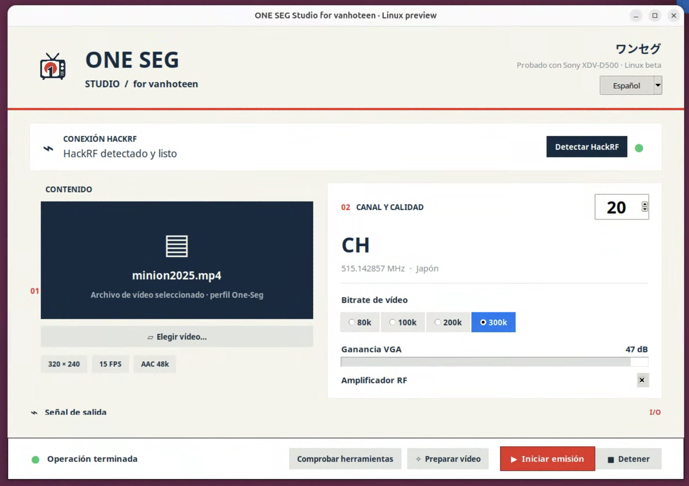

# ONE SEG Studio for Linux

## 🌐 Choose your language

### [🇬🇧 English](README.md)
### [🇪🇸 Castellano](README.es.md)
### [ Asturianu](README.ast.md)
### [🇩🇪 Deutsch](README.de.md)
### [ Català](README.ca.md)

---


> **EXPERIMENTAL TEST BUILD — Ubuntu 26.04 LTS · amd64 (Intel/AMD 64-bit). Not a stable release.**

Created by **vanhoteen**, ONE SEG Studio prepares video and generates a Japanese One-Seg television signal using a HackRF One. In the usual Japanese ISDB-T configuration, the central one of thirteen segments carries a lower-resolution service for portable receivers, without Internet reception.

## Interface

ONE SEG Studio for Linux includes a **Spanish and English** interface. The language selector changes the complete application interface, including preparation, HackRF detection, transmission controls and status messages.



## What has been tested?

The author successfully compiled and installed this Linux preview on Ubuntu 26.04 amd64 and confirmed reception on a Sony XDV-D500. The preparation test also passed H.264 320×240 video, AAC audio and TS packet-alignment checks, reporting zero continuity errors. This is a successful user test, not certification of compliance or a guarantee for every receiver.

## Download and installation

[Open Releases — installer downloads](https://github.com/vanhoteen/ONE-SEG-Studio-for-Linux---Ubuntu-26.04-amd64-Preview/releases)

Download [**Onestudio_linux-ubuntu26-amd64-preview4-clean.zip** from release 0.2](https://github.com/vanhoteen/ONE-SEG-Studio-for-Linux---Ubuntu-26.04-amd64-Preview/releases/download/0.2/Onestudio_linux-ubuntu26-amd64-preview4-clean.zip). GitHub's automatic **Source code** archives are for building, not the ready-to-install package.

Download and extract the **complete installer folder**. Keep both `.deb` packages, `INSTALL.sh`, `UBUNTU_VERSION` and `SHA256SUMS` together. Open a terminal in that folder and run:

```bash
bash INSTALL.sh
```

Enter your administrator password and wait. The installer verifies the packages and installs ONE SEG Studio, TSDuck and the required Ubuntu dependencies, including GNU Radio, FFmpeg, Python and HackRF support. **Internet is required; no compilation is needed on the destination computer.** Existing dependencies are reused. The small download is not a self-contained runtime like the Mac DMG.

Open **ONE SEG Studio** from the desktop applications menu. A graphical desktop is required; a plain SSH terminal will not display the window.

## First use

1. Connect HackRF by USB.
2. Click **Check tools**, then **Detect HackRF**.
3. Select a video, channel, bitrate and gain.
4. Click **Prepare video** and wait.
5. **Transmit** starts RF; **Stop** ends it. Installation, checking tools and preparation do not start transmission.

Video: 320×240 at 15 fps. Bitrates: 80, 100, 200 or 300 kb/s; AAC audio at 48 kb/s. The RF amplifier starts enabled and VGA gain defaults to 47 dB. Changing settings requires preparing the video again.

## Preview limitations

Spanish and English Linux interface. Other distributions and architectures are unverified. Files are finite tests; seamless looping is not guaranteed. Camera/capture inputs and the integrated waveform display are not implemented. A legacy log message may mention a graph although this Linux interface has none. SI tables use a dated file snapshot. Work files live in `~/.local/share/one-seg-studio` by default.

## RF responsibility

Check your country's frequency, power and licensing requirements before transmitting. A Japanese channel number does not authorize use of that frequency elsewhere. Use an appropriate conducted or shielded setup where needed and avoid harmful interference. The user is responsible for authorization, configuration and operation. This educational project does not grant permission to transmit. To the extent allowed by law, the author assumes no responsibility for unauthorized operation or interference caused by the user.

## Build from source

On the target Ubuntu machine, run `bash linux/build-deb.sh --install-deps`. This builds gr-isdbt against that machine's Python and GNU Radio, performs a preparation test without RF and produces the installer folder. The builder supports 24.04 and 26.04; **only 26.04 amd64 has been tested by the author**. Packages are specific to the Ubuntu/Python/GNU Radio versions used to build them. See [Linux build notes](linux/README.md) and [licensing](LICENSE-NOTICE.md).

## Demo · One-Seg

[](https://youtu.be/hW7jU8Ro0uk)

[macOS project](https://github.com/vanhoteen/ONE-SEG-Studio-)
